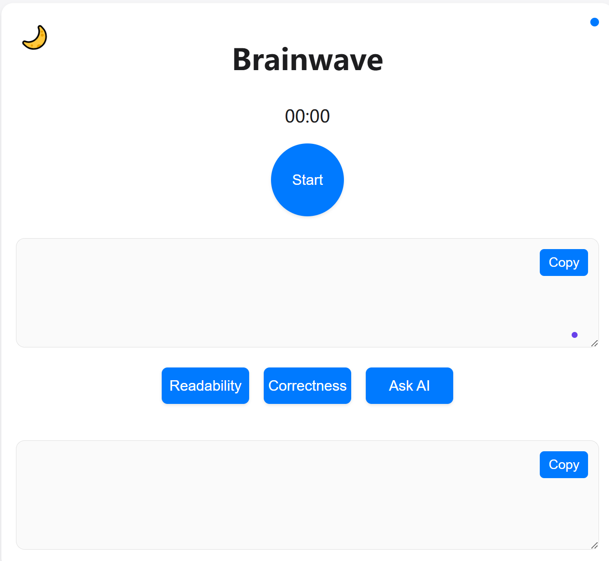

```markdown
# Brainwave - 智能语音交互工具



一个基于语音识别与合成的智能交互工具，实现语音转文字、文字转语音的完整流程，支持中文交互和持续对话。

## 主要功能

- **语音输入**  
  🎤 通过麦克风录制语音（最长30秒）
- **语音转文本**  
  📝 使用Google Speech Recognition API进行中文识别
- **文本转语音**  
  🔊 通过gTTS生成并播放中文语音
- **交互式对话**  
  🔄 支持持续对话直到用户主动退出
- **临时文件管理**  
  🗑️ 自动清理生成的音频文件

## 技术栈

- `speech_recognition` - 语音识别核心库
- `gTTS` (Google Text-to-Speech) - 文本转语音
- `playsound` - 音频播放
- `PyAudio` - 麦克风输入支持

## 安装指南

1. 克隆仓库：
```bash
git clone https://github.com/yourusername/brainwave.git
cd brainwave
```

2. 安装依赖：
```bash
pip install speechrecognition gTTS playsound pyaudio
```

（Windows用户可能需要先安装PyAudio：）
```bash
pip install pipwin
pipwin install pyaudio
```

## 使用说明

```bash
python brainwave.py
```

**操作流程**：
1. 看到"请说话..."提示后开始说话
2. 程序自动转换语音为文字并显示
3. 自动播放转换后的语音反馈
4. 输入 `n` 退出程序，其他任意键继续

## 界面功能

- **Start** - 启动语音录制
- **Copy** - 复制识别结果
- **Readability** - 评估文本可读性
- **Correctness** - 验证语法正确性
- **Ask AI** - 获取AI优化建议

## 注意事项

⚠️ **必须条件**：
- 可用麦克风设备
- 互联网连接（依赖Google API）
- Python 3.6+

✨ **优化建议**：
- 在安静环境中使用
- 单次语音不超过30秒
- 调整`energy_threshold`适应环境噪音

## 未来计划

- [ ] 支持多语言切换
- [ ] 添加本地语音缓存
- [ ] 集成AI对话功能
- [ ] 开发图形界面(GUI)

## 项目结构

```
brainwave/
├── brainwave.py        # 主程序
├── README.md           # 说明文档
└── brainwave-ui.PNG    # 界面截图-TODO
```

## 授权协议

[MIT License](LICENSE)
```

> 请将实际截图文件重命名为`brainwave-ui.PNG`并放在项目根目录。如需调整任何功能描述或添加具体使用示例，可根据实际需求修改。